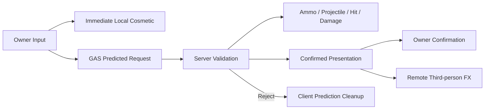

# ShootGame

[](https://www.unrealengine.com/)


基于 Unreal Engine 5.6 的多人网络射击学习项目。

项目以服务器权威、清晰的运行时职责和可重复验证为核心，逐步实现武器、Inventory、
Gameplay Ability、第一/第三人称表现、AI 与多人生命周期。当前重点是让每个网络闭环
都能被自动化证据证明，而不是单纯堆叠功能。

> 本项目仍在持续开发，不是可直接发布的完整游戏或通用射击框架。

## 当前能力

- 基于 GAS 的 Fire、Reload、Equip 能力与状态互斥。
- Owner 本地立即播放纯表现，服务器独占 Ammo、Projectile、Hit、Damage 与 Score。
- Semi-auto 与 Full-auto 本地表现遵守武器 `RefireRate`。
- Remote Client 只消费服务器确认后的第三人称表现。
- 武器启动配置快照、按类型预热的实体池，以及池耗尽后的按需 Spawn。
- Owner-only Inventory 数据、当前装备复制、双向切枪、死亡与断线清理。
- 第一/第三人称动画、瞄准同步、程序化 IK、Reload 与 Equip 表现。
- StateTree NPC、权威伤害、死亡、重生和基础计分流程。
- Build、Automation、Standalone、Dedicated、Listen、网络模拟与断线清理验证。

## 网络射击边界



当前不预测真实 Projectile。客户端预测只承担 Montage、Muzzle FX、Sound 与 Recoil，
所有 Gameplay 结果仍由服务器产生。详细不变量见
[网络射击 AI 自主验证契约](Docs/架构/网络射击AI自主验证契约.md)。

## 环境要求

- Windows 10/11。
- Unreal Engine 5.6。
- Visual Studio 2022 与 C++ 游戏开发工具链。
- Windows SDK 10.0.22621 或兼容版本。

仓库提供了 [.vsconfig](.vsconfig)，Visual Studio 可据此安装所需组件。

## 快速开始

```powershell
git clone https://github.com/fmoony/ShootGame.git
cd ShootGame
```

1. 确认 Unreal Engine 5.6 已安装。
2. 右键 `ShootGame.uproject` 生成 Visual Studio 项目文件，或运行项目刷新脚本。
3. 编译 `ShootGameEditor Win64 Development`。
4. 打开 `ShootGame.uproject`。
5. 加载 `/Game/Shooter/Maps/Lvl_Shooter` 开始运行。

刷新工程文件：

```powershell
powershell.exe -NoProfile -ExecutionPolicy Bypass `
    -File .\Scripts\Development\RefreshVisualStudioFiles.ps1
```

编译编辑器目标：

```powershell
powershell.exe -NoProfile -ExecutionPolicy Bypass `
    -File .\Scripts\Tests\BuildEditor.ps1
```

## 自动化验证

完整回归入口：

```powershell
powershell.exe -NoProfile -ExecutionPolicy Bypass `
    -File .\Scripts\Tests\RunAll.ps1
```

总控依次执行：

1. `ShootGameEditor` 编译。
2. `ShootGame` Automation Tests。
3. Standalone 地图冒烟。
4. Dedicated Server 与两个客户端。
5. Listen Server 与远端客户端。
6. `100ms` 延迟、`2%` 丢包的网络模拟。
7. Reload / Equip、死亡与主动断线清理。

机器可读结果保存在：

```text
Saved/Automation/Runs/<timestamp>/Summary.json
```

更多命令、日志位置和判定方式见[自动化测试文档](Docs/自动化测试.md)。

## 源码结构

```text
Source/ShootGame/
├── AbilitySystem/    # GAS、属性与 Gameplay Effect 工具
├── AI/               # NPC、AIController 与 StateTree 支撑
├── Characters/       # 角色、瞄准、装备与动画数据源
├── GameFramework/    # GameMode、GameState、Controller、PlayerState
├── Inventory/        # Owner-only Inventory 与运行时实例数据
├── Tests/            # Automation 与网络端到端验证
├── UI/               # HUD 与弹药显示
└── Weapons/          # 武器、配置、池、Pickup、开火行为与 Projectile
```

`Plugins/McpAutomationBridge` 是 Editor-only 自动化桥接插件，不参与运行时 Gameplay。

## 设计与开发文档

- [Inventory 与武器数据架构](Docs/架构/Inventory与武器数据架构.md)
- [网络射击 AI 自主验证契约](Docs/架构/网络射击AI自主验证契约.md)
- [完整 Demo 最终路线规划](Docs/执行计划/Shooter完整Demo最终路线规划.md)
- [动画分层与射击表现扩展规划](Docs/执行计划/动画分层与射击表现扩展规划.md)
- [代码规范](Docs/代码规范.md)
- [Agent 自动化验证操作手册](Docs/Agent自动化验证操作手册.md)

## 协作约定

- 服务器产生权威 Gameplay 结果，客户端只提交输入与本地表现。
- 网络功能按可验证闭环逐步实现，避免同时扩大多个系统边界。
- 源码与文档遵守项目换行、宽度、include 和开发记录规范。
- 新提交必须附带开发记录，并通过 staged 文本检查与 `git diff --check`。

详细规则见 [AGENTS.md](AGENTS.md)。

## License

本仓库当前未附带开源许可证。除非后续明确添加许可证，否则请勿假定代码和资产可被
复制、修改或再分发。
